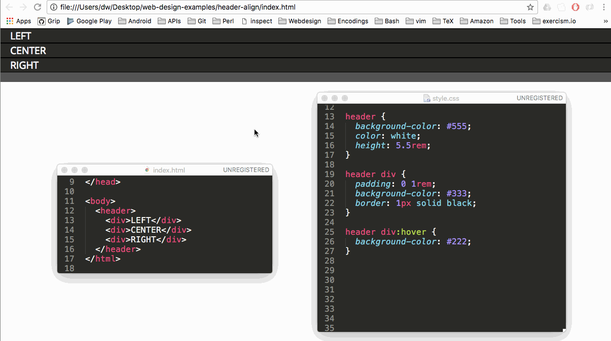

# Header Align 

[Check it out](https://weibeld.github.io/webdesign-header-align/)

A simple example of aligning items in a website header by using the CSS3 [Flexible Box](https://www.w3schools.com/css/css3_flexbox.asp) model.

## Summary

Summary of approaches to center elements [here](https://www.w3.org/Style/Examples/007/center.en.html).

## Flexbox References

- <https://www.w3schools.com/css/css3_flexbox.asp>
- <https://developer.mozilla.org/en-US/docs/Web/CSS/CSS_Flexible_Box_Layout>
- <https://css-tricks.com/snippets/css/a-guide-to-flexbox/>
